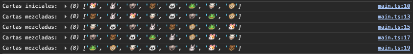
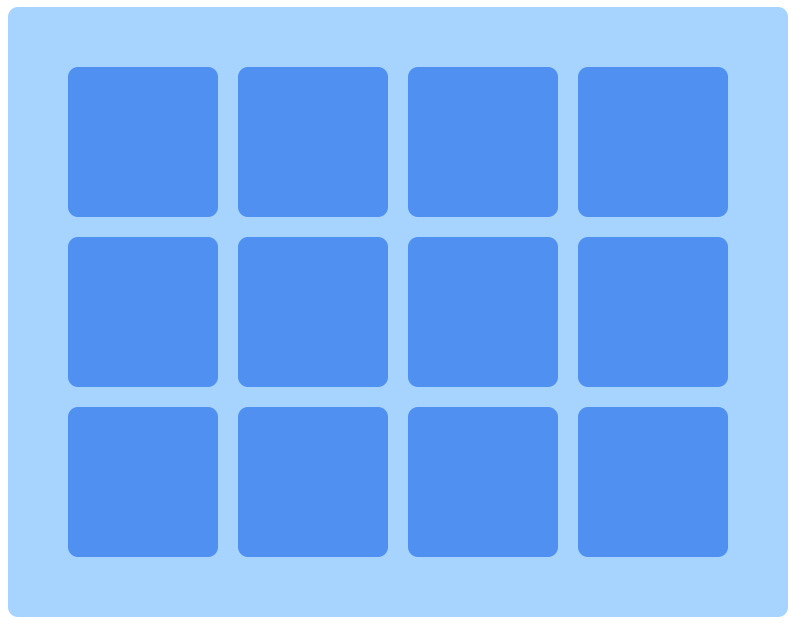
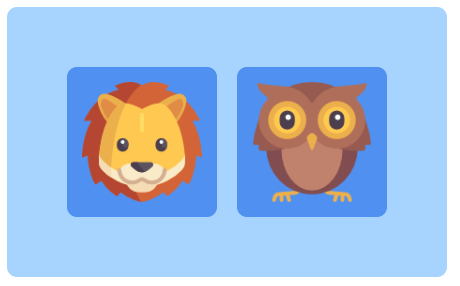
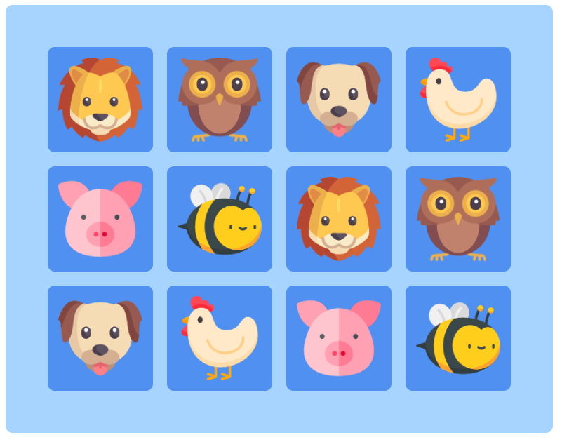

# Módulo 8.1 - Aplicación juego de memoria

Pasos:

- Clonate el proyecto.
- Instala las dependencias con `npm install`.
- Ejecuta el sandbox con `npm run dev`.
- Abre el navegador en `http://localhost:5173/` (si ese puerto no te funciona, mira en la consola donde has hecho el build, puede que este ocupado y se haya abierto en otro puerto).

Antes de poner el marcha el juego realizamos una serie de pruebas de concepto. Cada una de estas pruebas estará dentro de una carpeta independiente en el archivo _src_. Y para poder acceder al index de cada prueba deberemos modificar la url de entrada para llegar hasta la carpeta correspondiente.

## Prueba 1 - barajar las cartas

URL: http://localhost:5173/src/prueba1/index.html

Partimos de un array de cartas que debemos "mezclar". Devolvemos el array pero con los elementos "desordenados" para conseguir un resultado aleatorio.

Con la `function shuffle` recorremos todos los elementos modificando la posición de forma aleatoria.



## Prueba 2 - Mostrar imagen y volver la carta

URL: http://localhost:5173/src/prueba2/index.html

Creamos un div con la imagen "vacía" y al hacer click de cambia por la imagen que definimos en la función.

Primero, en main.ts describimos el cambio y despues lo ejecutamos al hacer click sobre el div.

## Prueba 3 - Mostrar un grid de cartas

URL: http://localhost:5173/src/prueba3/index.html

Duplicamos las card hasta tener 12 y desde el style.css aplicamos los estilos:

```#app {
  display: inline-grid;
  grid-template-columns: repeat(4, 1fr);
  gap: 20px;
  padding: 60px;
  background-color: rgb(167, 212, 255);
  border-radius: 10px;
}
```



## Prueba 4 - mostrar 2 cartas

Duplicamos lo creado en el htlm y el main.ts de la Prueba 2, solo que diferenciando entre la card A y la card B.
Después, cogemos los estilos aplicados en el css de la Prueba 3 y los aplicamos a las cards. En este caso al tener solo 2 cards, en lugar de 12 debemos ajustar la grid para que funcione con 2 columnas en lugar de con 4.



## Prueba 5 - mapear el DIV y asignar las img correspondientes teniendo en cuenta su data-indice-id

Definimos el array incluyendo el idFoto (del 1 al 6 x2, ya que se repiten las tarjetas) y asignando las url a las imágenes.

En el html cada card cuenta con una imagen y le asignamos un data-indice-id (del 0 al 11 para que coincida con el índice del array). Hacemos un `.map´para recorrer el array completo y asignar a cada card su imagen.


